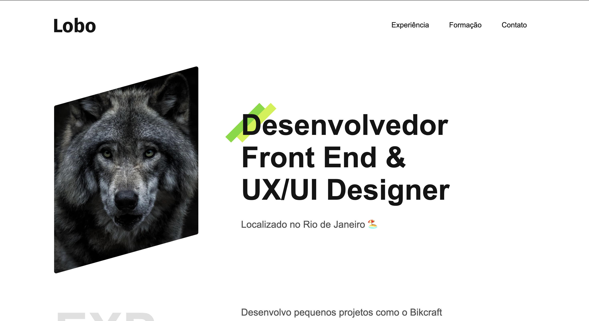

# 🐺 Portfolio Lobo

🔗 **Acesse o site:** https://wsfraga.github.io/Portfolio-Lobo/

## 🖼️ Preview

## 📖 Descrição
Projeto de **portfólio pessoal** desenvolvido com foco em **Front-End**, utilizando apenas **HTML e CSS**.

O projeto foi desenvolvido como parte dos estudos no **curso da Origamid**, com adaptações e melhorias próprias para reforçar conceitos de estruturação, estilização e responsividade.

## 🚀 Tecnologias utilizadas
- HTML
- CSS

## ⚙️ Como executar o projeto
1. Clone o repositório:
git clone https://github.com/wsfraga/portfolio-lobo.git
3. Entre na pasta do projeto:
4. Abra o arquivo `index.html` no navegador.

## 📌 Funcionalidades
- Apresentação pessoal
- Seção de Experiência
- Seção de Formação
- Layout responsivo
- Estrutura simples e organizada

## 🧠 Aprendizados
- Estruturação semântica com HTML
- Estilização com CSS
- Responsividade
- Organização de arquivos
- Boas práticas de Front-End
